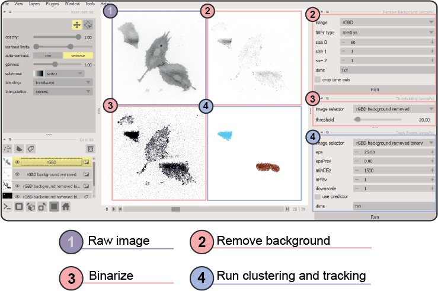

# arcosPx-napari

## Introduction

This repository contains a dedicated ARCOS.px plugin for the [napari](https://napari.org/stable/) image viewer. It tracks spatio-temporal correlations in images as described in a publication of Grädel et al. _Tracking Coordinated Cellular Dynamics in Time-Lapse Microscopy with ARCOS.px_ ([link](https://doi.org/10.1101/2025.03.14.643386)).

  
&nbsp; &nbsp; &nbsp; &nbsp;
   

ARCOS.px is a computational method to identify and track clusters of correlated cell signaling in time-lapse microscopy images. 
It is the latest addition to the [ARCOS ecosystem](https://arcos.gitbook.io/home) developed in the [Cellular Dynamics Lab](https://www.pertzlab.net) at the University of Bern.

<!--
Don't miss the full getting started guide to set up your new package:
https://github.com/napari/cookiecutter-napari-plugin#getting-started

and review the napari docs for plugin developers:
https://napari.org/stable/plugins/index.html
-->

## Example tracking

Actin polymerization waves in REF52 fibroblasts treated with 50 ng/mL PDGF, 24h before imaging.

## Installation

You can install `arcosPx-napari` via [pip]:

    pip install arcosPx-napari

To install latest development version :

    pip install git+https://github.com/bgraedel/arcosPx-napari.git

## Contributing

Contributions are very welcome. Tests can be run with [tox], please ensure
the coverage at least stays the same before you submit a pull request.

## License

Distributed under the terms of the [BSD-3] license,
"arcosPx-napari" is free and open source software

## Issues

If you encounter any problems, please [file an issue] along with a detailed description.

[napari]: https://github.com/napari/napari
[Cookiecutter]: https://github.com/audreyr/cookiecutter
[@napari]: https://github.com/napari
[MIT]: http://opensource.org/licenses/MIT
[BSD-3]: http://opensource.org/licenses/BSD-3-Clause
[GNU GPL v3.0]: http://www.gnu.org/licenses/gpl-3.0.txt
[GNU LGPL v3.0]: http://www.gnu.org/licenses/lgpl-3.0.txt
[Apache Software License 2.0]: http://www.apache.org/licenses/LICENSE-2.0
[Mozilla Public License 2.0]: https://www.mozilla.org/media/MPL/2.0/index.txt
[cookiecutter-napari-plugin]: https://github.com/napari/cookiecutter-napari-plugin

[file an issue]: https://github.com/bgraedel/arcosPx-napari/issues

[napari]: https://github.com/napari/napari
[tox]: https://tox.readthedocs.io/en/latest/
[pip]: https://pypi.org/project/pip/
[PyPI]: https://pypi.org/
